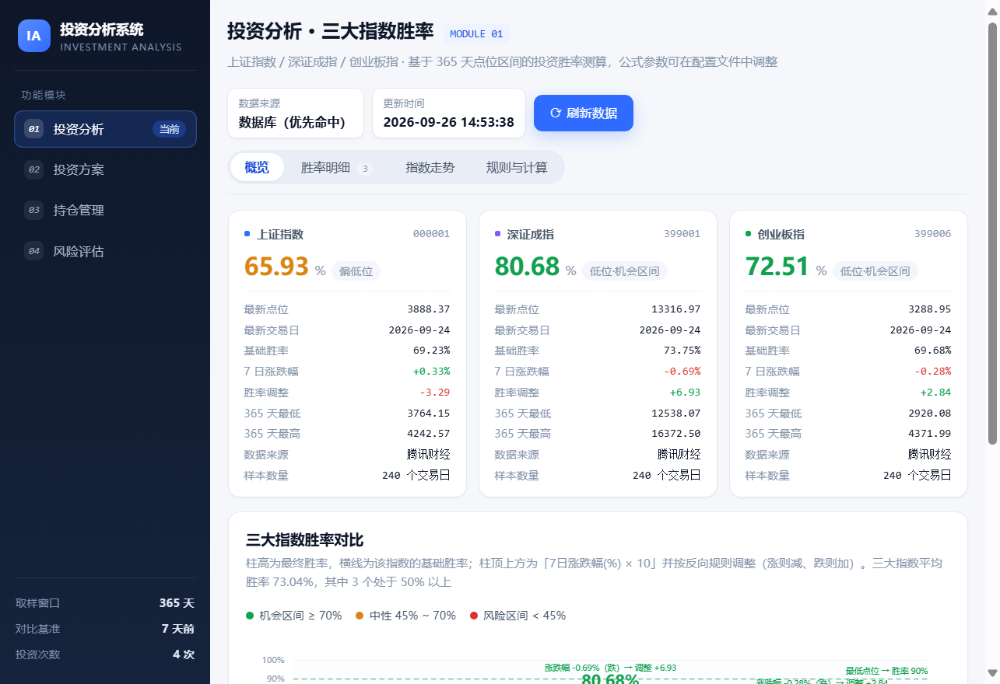
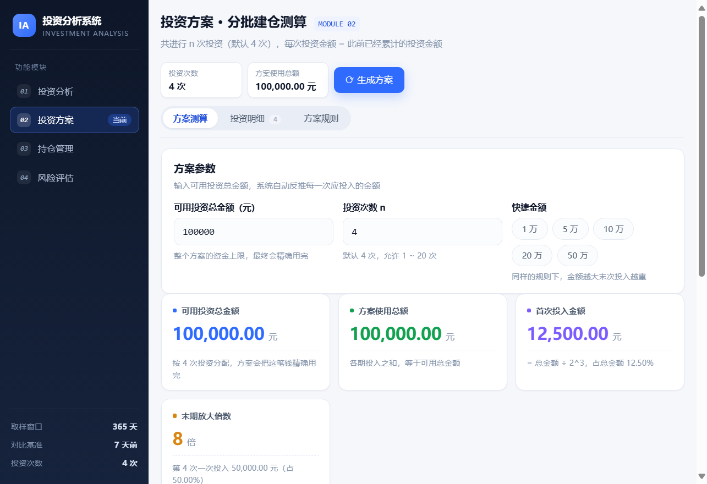
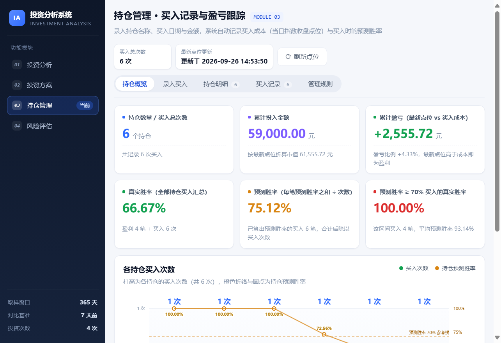
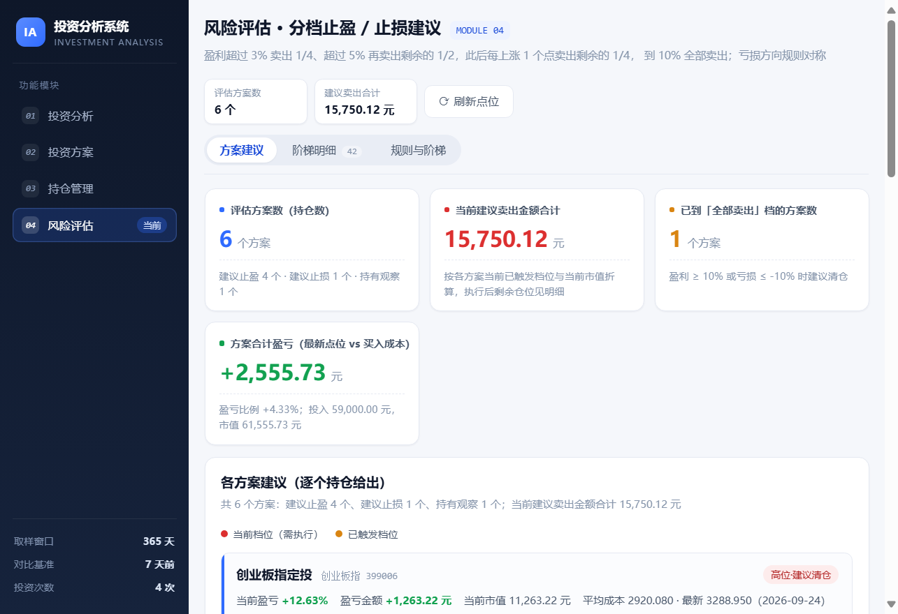

# 网页版投资分析系统

基于 **Spring Boot + MyBatis-Plus + MySQL + 原生前端** 的投资分析系统，包含四个模块：

| 序号 | 模块 | 说明 |
| --- | --- | --- |
| 1 | **投资分析** | 上证指数（000001）、深证成指（399001）、创业板指（399006）365 天行情与投资胜率测算 |
| 2 | **投资方案** | 按「n 次投资，每次投入 = 此前累计投入」的规则，把可用总金额拆成每一期投入金额（**纯测算，不落库**） |
| 3 | **持仓管理** | 录入持仓名称 / 买入日期 / 买入金额，落库保存买入成本与买入时的预测胜率，按最新点位判断盈亏，并统计真实胜率与预测胜率 |
| 4 | **风险评估** | 针对每个持仓按当前盈亏比例给出分档止盈 / 止损建议（3% 卖 1/4、5% 再卖 1/2、此后每涨 1 个点卖剩余 1/4、到 10% 全部卖出；亏损方向对称） |









> 页面按「模块 → 页签」组织：顶部标题与页签吸顶固定，页签分别是
> 投资分析（概览 / 胜率明细 / 指数走势 / 规则与计算）、投资方案（方案测算 / 投资明细 / 方案规则）、
> 持仓管理（持仓概览 / 录入买入 / 持仓明细 / 买入记录 / 管理规则）、风险评估（方案建议 / 阶梯明细 / 规则与阶梯），
> 页签状态同步在地址栏（如 `#/risk/detail`），可直接分享或刷新后停留原页签。

---

## 一、功能说明

### 模块一：投资分析

| 需求 | 实现方式 |
| --- | --- |
| 获取三大指数 365 天指数数值 | `IndexDataService` 优先读取数据库 `index_daily`，库中无数据 / 数据不完整 / 数据已过期时自动调用行情接口拉取并落库 |
| 计算最新投资胜率 | 取 365 天窗口内的最低值与最高值，最低点胜率 90%、最高点胜率 10%，区间内线性均分 |
| 计算最新一天对比 7 天前的涨跌幅 | 按自然日回溯 7 天后取最近的交易日作为基准（可切换为「倒数第 7 根 K 线」） |
| 胜率叠加涨跌幅 | `最终胜率 = 基础胜率 − 涨跌幅(%) × 10`（**涨则减、跌则加**），并限制在 0% ~ 100% |
| 表格 + 柱形图展示 | 提供胜率明细表格、HTML5 柱形图，并附带 365 天走势折线图与逐步计算过程 |

### 模块二：投资方案

| 需求 | 实现方式 |
| --- | --- |
| 总共进行 n 次投资，n 可配置 | `plan.default-times` 默认 **4** 次，页面可直接修改，允许范围由 `plan.min-times` ~ `plan.max-times` 控制（默认 1 ~ 20） |
| 每次投资金额 = 此前已经累计的投资金额 | `InvestmentPlanService` 按 `第 k 次 = 前 k-1 次累计投入` 递推，各期金额依次为 `B、B、2B、4B…` |
| 用户输入可用的投资总金额 | 页面输入框 / 快捷金额按钮，反推首次投入 `B = T ÷ 2^(n-1)` |
| 生成每一次投资金额与使用的总体金额 | 输出每期金额、累计投入、占比与计算说明；使用总额精确等于输入的可用总金额（末次做分位尾差调整） |
| 只做参考、不保存 | 方案完全实时计算、**不写入数据库**，页面也不提供历史方案；刷新或重新输入即重新测算 |

### 模块三：持仓管理

| 需求 | 实现方式 |
| --- | --- |
| 用户输入持仓名称、具体日期与买入金额 | 页面「录入买入」页签提交，同名 + 同关联指数的持仓自动合并，仅累加买入次数 |
| 数据库保存这些信息以及成本、买入时的预测胜率 | 持仓主表 `holding_position` + 买入记录表 `holding_buy_record`；成本 = 买入日（非交易日向前取最近交易日）该指数收盘点位；预测胜率 = 以买入日为终点、最近 365 天行情按投资分析模块同一套规则算出的最终胜率，算式一并落库 |
| 用图表展示买入的具体次数 | 「持仓概览」页签的柱形图：柱高为各持仓买入次数，橙色折线与圆点为持仓预测胜率（并标注 70% 参考线） |
| 根据最新价格判断如今是盈还是亏 | 以关联指数最新点位为最新价格：单笔盈亏 = 买入金额 ×（最新点位 − 买入成本）÷ 买入成本；持仓按加权平均成本口径汇总市值与盈亏 |
| 统计所有持仓的方案结果的真实胜率 | 真实胜率 = 按最新点位判断当前盈利的买入笔数 ÷ 买入次数，跨全部持仓汇总，同时给出每个持仓的真实胜率 |
| 统计预测胜率 70% 以上买入时的胜率 | 筛选买入时预测胜率 ≥ 70% 的买入记录，单独统计其真实胜率与平均预测胜率（阈值可配置） |
| 预测胜率用每次买入的预测胜率除以次数来计算 | 持仓预测胜率 = 每笔买入的预测胜率之和 ÷ 买入次数（未算出预测胜率的买入按 0 参与平均，并在明细中标注原因） |

### 模块四：风险评估

| 需求 | 实现方式 |
| --- | --- |
| 针对具体持仓管理给出建议 | 直接读取持仓管理的持仓、买入成本与关联指数最新点位，一个持仓对应一个评估方案 |
| 盈利超过 3% 卖出 1/4 | 止盈阶梯第 1 档 `+3% → 卖出剩余仓位的 1/4` |
| 盈利超过 5% 再卖 1/2 | 止盈阶梯第 2 档 `+5% → 再卖出剩余仓位的 1/2`（累计卖出 62.5%、剩余 37.5%） |
| 后续每增长一个点都建议卖出剩余的 1/4 | 止盈阶梯 `+6% / +7% / +8% / +9%` 四档，每档卖出当时剩余仓位的 1/4 |
| 十个点则全部卖出 | 止盈阶梯末档 `+10% → 全部卖出（清仓）` |
| 亏损也是类似的处理 | 止损阶梯与止盈完全对称：`-3%` 卖 1/4、`-5%` 再卖 1/2、`-6% ~ -9%` 每档卖剩余 1/4、`-10%` 全部卖出 |
| 用列表展示每个方案的建议 | 「方案建议」页签：每个持仓一张卡片，给出当前应执行的动作、金额、已触发档位、执行后剩余仓位与下一档触发点；「阶梯明细」页签：每个持仓 × 每一档一行，列出触发点、卖出比例、该档卖出量占初始仓位、累计卖出、剩余仓位、预计卖出金额与状态 |

## 二、技术栈

- 后端：Java 8、Spring Boot 2.6.13、MyBatis-Plus 3.5.15、Fastjson
- 数据库：MySQL 8.x（`mysql-connector-java` 8.0.33）
- 前端：原生 HTML / CSS / JavaScript + SVG 手绘图表（**无任何外部 CDN 依赖，可完全离线打开**）
- 构建：Maven 3.6+

## 三、目录结构

```
Investment Analysis/
├── pom.xml
├── README.md
├── docs/                                             README 引用的界面截图
└── src
    ├── main
    │   ├── java/com/investment/analysis
    │   │   ├── InvestmentAnalysisApplication.java   启动类
    │   │   ├── common/                              统一响应、异常处理
    │   │   ├── config/                              AnalysisProperties / PlanProperties / HoldingProperties / RiskProperties
    │   │   ├── controller/                          投资分析、投资方案、持仓管理、风险评估四个 REST 控制器
    │   │   ├── entity/                              数据库实体（行情 / 胜率结果 / 持仓 / 买入记录）
    │   │   ├── mapper/                              MyBatis-Plus Mapper
    │   │   ├── model/                               指数定义、请求参数与各模块 VO
    │   │   ├── provider/                            三个行情数据源 + 熔断器
    │   │   ├── service/                             数据装载、胜率计算、投资方案、持仓盈亏、风险评估
    │   │   └── task/                                启动预热与定时刷新
    │   └── resources
    │       ├── application.yml                      端口、数据源、analysis.* / plan.* / holding.* / risk.* 参数
    │       ├── db/schema.sql                        建表脚本（启动自动执行）
    │       └── static/                              前端页面 index.html / css / js（模块化单页，多页签）
    └── test/java/com/investment/analysis/service
        ├── WinRateCalculatorTest.java               胜率公式单元测试
        ├── InvestmentPlanServiceTest.java           投资方案规则单元测试
        ├── HoldingCalculatorTest.java               持仓盈亏 / 真实胜率 / 预测胜率单元测试
        └── RiskCalculatorTest.java                  分档止盈止损建议单元测试
```

## 四、快速开始

### 1. 准备数据库

只要 MySQL 已启动即可，**无需手工建库建表**：连接串带有 `createDatabaseIfNotExist=true`，
启动时会自动创建数据库 `investment_analysis` 并执行 `src/main/resources/db/schema.sql`。

如需修改连接信息，编辑 `src/main/resources/application.yml`，或使用环境变量覆盖：

```bash
set DB_USERNAME=root
set DB_PASSWORD=你的密码
```

### 2. 启动应用

```bash
# 方式一：源码运行
mvn spring-boot:run

# 方式二：打包后运行
mvn clean package
java -jar target/investment-analysis-1.0.0.jar
```

### 3. 访问页面

浏览器打开 <http://localhost:8080/>

首次启动会自动拉取三大指数 365 天数据（约 240 个交易日 / 指数）并写入数据库，页面可直接查看结果。

## 五、接口说明

| 方法 | 路径 | 说明 |
| --- | --- | --- |
| GET | `/api/analysis/indices` | 模块覆盖的指数列表 |
| GET | `/api/analysis/win-rate?refresh=false` | 三大指数胜率汇总（表格 + 柱形图数据源） |
| POST | `/api/analysis/refresh` | 强制调用行情接口刷新数据后重新计算 |
| GET | `/api/analysis/trend?code=399006&days=365` | 指数走势数据（折线图） |
| GET | `/api/analysis/records?code=000001&days=365` | 指数原始日线数据 |
| GET | `/api/analysis/history?limit=30` | 历史分析结果 |
| GET | `/api/analysis/latest-snapshot` | 最近一次分析快照 |

投资方案模块接口（`InvestmentPlanController`）：

| 方法 | 路径 | 说明 |
| --- | --- | --- |
| GET | `/api/plan/config` | 页面初始化参数：默认投资次数、允许范围、默认金额 |
| POST | `/api/plan/generate` | 生成投资方案，请求体 `{"totalAmount": 100000, "times": 4}` |

持仓管理模块接口（`HoldingController`）：

| 方法 | 路径 | 说明 |
| --- | --- | --- |
| GET | `/api/holding/config` | 可关联指数、预测胜率阈值、取样窗口、日期范围与规则说明 |
| GET | `/api/holding/overview` | 持仓总览：持仓列表 + 每笔买入明细 + 汇总统计 + 最新行情 |
| POST | `/api/holding/buy` | 新增买入，请求体 `{"positionName": "上证指数定投", "indexCode": "000001", "buyDate": "2026-07-17", "buyAmount": 10000}` |
| POST | `/api/holding/refresh` | 强制刷新最新点位后返回总览 |
| DELETE | `/api/holding/position/{id}` | 删除持仓及其全部买入记录 |
| DELETE | `/api/holding/record/{id}` | 删除单笔买入记录（持仓无记录时一并删除） |

风险评估模块接口（`RiskController`）：

| 方法 | 路径 | 说明 |
| --- | --- | --- |
| GET | `/api/risk/config` | 止盈 / 止损阶梯预览与规则文案 |
| GET | `/api/risk/overview` | 方案建议列表 + 阶梯明细 + 汇总统计 |
| POST | `/api/risk/refresh` | 刷新最新点位后重新评估 |

返回结构统一为：

```json
{ "success": true, "code": 200, "message": "OK", "data": { } }
```

## 六、胜率计算规则

1. **取样窗口**：最近 365 天（含最新交易日）的全部指数数值，最低值记为 `min`、最高值记为 `max`。
2. **基础胜率**：位于最低点记 `90%`，位于最高点记 `10%`，区间内线性均分：

   ```
   基础胜率 = 10 + (90 - 10) × (max - 最新值) ÷ (max - min)
   ```

3. **涨跌幅**：用最新一天数值对比 7 天前的数值，得到的是**百分比**，不是点位差：

   ```
   涨跌幅(%) = (最新一天数值 - 7 天前数值) ÷ 7 天前数值 × 100%      # 下跌为负数
   ```

4. **调整项方向（反向）**：涨跌幅**反向**作用于胜率——**指数上涨则扣减胜率，指数下跌则增加胜率**。
   这与模型本身「点位越低胜率越高」是一致的：涨上去说明位置变贵，胜率应当下降。
5. **最终胜率**：把上一步的**百分比数值**乘以 10 并按反向取号作为调整项——既不是「点位差 × 10」，也不是「百分比的小数形式 × 10」：

   ```
   最终胜率 = 基础胜率 - 涨跌幅(%) × 10      # 结果限制在 0% ~ 100%
   ```

   若窗口内指数完全走平（`max = min`），基础胜率取高低点中间值 50%。

   换算系数可通过 `analysis.change-multiplier` 调整，作用方向可通过 `analysis.change-direction` 切换
   （`INVERSE` 涨减跌加，默认；`DIRECT` 涨加跌减）；若希望按「百分比的小数形式 × 10」计算，把系数设为 `0.1` 即可。

以示例数据为例（上证指数）：

| 项 | 数值 |
| --- | --- |
| 最新收盘 / 最新交易日 | 3888.37 / 2026-09-24 |
| 365 天最低 / 最高 | 3764.15（2026-07-17） / 4242.57（2026-05-13） |
| 基础胜率 | `10 + 80 × (4242.57 - 3888.37) ÷ (4242.57 - 3764.15) = 69.2283%` |
| 7 日对比基准（2026-09-17） | 3875.60；`(3888.37 - 3875.60) ÷ 3875.60 × 100% = +0.3295%` |
| 涨跌幅调整 | `0.3295% × 10 = 3.295`，指数**上涨**故胜率**扣减** → `-3.295` |
| 对照：若误用点位差 | `12.77 点 × 10 = 127.7`（错误算法，本项目不使用） |
| **最终胜率** | **`69.2283 - 3.295 = 65.9333%`，页面展示为 65.93%** |

页面底部「胜率计算过程（逐步核对）」面板会把三个指数代入实际数值后的完整算式逐条列出，可直接对照验算第 1 ~ 5 步。

反向规则的实际效果（同一批数据）：

| 指数 | 7 日涨跌幅 | 调整项 | 基础胜率 → 最终胜率 |
| --- | --- | --- | --- |
| 上证指数 | +0.3295%（涨） | −3.295 | 69.2283% → **65.9333%** |
| 深证成指 | −0.6931%（跌） | +6.931 | 73.7494% → **80.6804%** |
| 创业板指 | −0.2838%（跌） | +2.838 | 69.6754% → **72.5134%** |

## 七、投资方案模块规则

**规则**：总共进行 n 次投资（n 默认 4，可配置），**每次投资金额 = 此前已经累计的投资金额**。

设首次投入为 `B`，则各期金额依次为：

```
第 1 次：B
第 2 次：B                      （= 第 1 次累计）
第 3 次：B + B     = 2B         （= 前 2 次累计）
第 4 次：B + B + 2B = 4B        （= 前 3 次累计）
...
第 k 次：2^(k-2) × B
```

n 次累计使用金额为 `B × 2^(n-1)`。令它等于用户输入的可用总金额 `T`，反推出首次投入：

```
B = T ÷ 2^(n-1)
```

以 **T = 100000 元、n = 4** 为例：

| 期次 | 本期投入（元） | 占总额 | 累计投入（元） | 累计占比 | 说明 |
| --- | --- | --- | --- | --- | --- |
| 第 1 次 | 12,500.00 | 12.5% | 12,500.00 | 12.5% | 首次基础投入 = 100000 ÷ 2³ |
| 第 2 次 | 12,500.00 | 12.5% | 25,000.00 | 25.0% | = 前 1 次累计投入 |
| 第 3 次 | 25,000.00 | 25.0% | 50,000.00 | 50.0% | = 前 2 次累计投入 |
| 第 4 次 | 50,000.00 | 50.0% | 100,000.00 | 100.0% | = 前 3 次累计投入 |
| **合计** | **100,000.00** | **100%** | — | — | **使用的总体金额 = 输入的可用总金额** |

不同 n 下的资金节奏（以 T = 100000 元为例）：

| n | 各期投入金额（元） | 末期放大倍数 |
| --- | --- | --- |
| 1 | 100,000.00 | 1 × |
| 2 | 50,000.00 → 50,000.00 | 2 × |
| 3 | 25,000.00 → 25,000.00 → 50,000.00 | 4 × |
| 4 | 12,500.00 → 12,500.00 → 25,000.00 → 50,000.00 | 8 × |
| 5 | 6,250.00 → 6,250.00 → 12,500.00 → 25,000.00 → 50,000.00 | 16 × |

> 说明：金额保留到「分」，当总金额无法被 `2^(n-1)` 整除时，最后一次用「总金额 − 此前累计」计算，
> 保证**使用的总体金额精确等于你输入的可用总金额**，差额仅在分位级别并在表格中标注。
>
> 该模块仅用于投资前的参考测算：结果由接口实时计算返回，**不写入数据库**，页面也不展示历史方案。

## 八、持仓管理模块规则

### 1. 落库内容

| 表 | 关键字段 | 说明 |
| --- | --- | --- |
| `holding_position` | `position_name`、`index_code`、`index_name` | 一个持仓 = 持仓名称 + 关联指数，同名同指数唯一 |
| `holding_buy_record` | `buy_date`、`buy_amount`、`cost_trade_date`、`cost_price`、`buy_win_rate`、`win_rate_period_start/end`、`win_rate_sample_count`、`win_rate_formula`、`win_rate_note` | 每笔买入的日期、金额、成本（点位）与买入时的预测胜率及其算式 |

### 2. 计算口径

```
买入成本      = 买入日（非交易日则向前取最近交易日）关联指数的收盘点位
买入时预测胜率 = 以买入日为终点、最近 365 天行情按第六节规则算出的最终胜率
单笔盈亏      = 买入金额 × (最新点位 − 买入成本) ÷ 买入成本
持仓市值      = Σ(买入金额 ÷ 买入成本) × 最新点位         # 加权平均成本口径
持仓盈亏      = 持仓市值 − 累计买入金额
真实胜率      = 当前盈利的买入笔数 ÷ 买入次数            # 覆盖全部持仓汇总
预测胜率      = 每笔买入的预测胜率之和 ÷ 买入次数
```

以示例数据为例：

| 持仓 | 买入 | 成本 | 最新点位 | 盈亏 | 买入时预测胜率 | 结果 |
| --- | --- | --- | --- | --- | --- | --- |
| 创业板指定投 | 2025-11-21 / 10,000 元 | 2920.080 | 3288.950 | **+1,263.22 元（+12.63%）** | 100.00% | 盈利 |
| 深证成指定投 | 2025-11-24 / 20,000 元 | 12585.080 | 13316.970 | **+1,163.11 元（+5.82%）** | 100.00% | 盈利 |
| 深证成指试探 | 2026-09-01 / 8,000 元 | 13872.380 | 13316.970 | **−320.30 元（−4.00%）** | 52.96% | 亏损 |

全部持仓汇总：投入 59,000.00 元、市值 61,555.73 元、真实胜率 66.67%（盈利 4 笔 ÷ 买入 6 次）、
预测胜率 75.12%，其中预测胜率 ≥ 70% 的 4 笔买入真实胜率 100.00%。

### 3. 边界与提示

- 买入日期早于库中可用行情起点（当前最早 2025-09-26）时拒绝录入，并提示可取数的最早日期。
- 买入日前可用交易日不足 20 个时，该笔只记录成本、不计算预测胜率，并在明细中标注原因（阈值 `holding.min-win-rate-samples`）。
- 买入日与非交易日冲突时，成本与预测胜率统一取「最近交易日」并在明细中提示。

## 九、风险评估模块规则

**止盈阶梯**（各档卖出比例均指「触发时剩余仓位」的比例，逐档执行）：

| 触发点 | 建议动作 | 累计卖出（占初始仓位） | 执行后剩余 |
| --- | --- | --- | --- |
| +3% | 卖出剩余仓位的 1/4 | 25% | 75% |
| +5% | 再卖出剩余仓位的 1/2 | 62.5% | 37.5% |
| +6% | 卖出剩余仓位的 1/4 | 71.875% | 28.125% |
| +7% | 卖出剩余仓位的 1/4 | 78.906% | 21.094% |
| +8% | 卖出剩余仓位的 1/4 | 84.180% | 15.820% |
| +9% | 卖出剩余仓位的 1/4 | 88.135% | 11.865% |
| +10% | 全部卖出（清仓） | 100% | 0% |

**止损阶梯**与止盈完全对称：`-3%` 卖 1/4、`-5%` 再卖 1/2、`-6% ~ -9%` 每档卖剩余 1/4、`-10%` 全部卖出。

```
当前建议     = 已触发档位中最深的一档，给出动作与「按当前市值折算」的建议卖出金额
执行后剩余   = 该档执行后的剩余仓位（例如 +5% 档执行后剩余 37.5%）
预计卖出金额 = 当前市值 × 该档卖出量占初始仓位的比例
```

以示例数据为例：

| 持仓 | 当前盈亏 | 风险等级 | 当前建议 | 下一档 |
| --- | --- | --- | --- | --- |
| 创业板指定投 | +12.63% | 高位·建议清仓 | 全部卖出 ≈ 1,336.41 元 | 已到最后一档 |
| 深证成指定投 | +5.82% | 止盈区 | 卖出 1/2 ≈ 7,936.17 元（执行后剩余 37.5%） | +6%，还差 0.18 个点 |
| 上证指数定投 | +3.30% | 止盈区 | 卖出 1/4 ≈ 2,582.50 元（执行后剩余 75%） | +5%，还差 1.70 个点 |
| 深证成指试探 | −4.00% | 止损区 | 卖出 1/4 ≈ 1,919.93 元（执行后剩余 75%） | −5%，还差 1.00 个点 |
| 上证观察仓 | −2.45% | 持有观察 | 未触发任何档位，继续持有观察 | −3%，还差 0.55 个点 |

> 建议金额按当前市值折算、未扣除此前已实际卖出的部分，实际执行请以账户剩余仓位为准；
> 评估结果仅为纪律化参考，不构成投资建议。

## 十、数据来源与容错策略

数据获取按以下优先级自动降级，任一数据源失败会自动尝试下一个，并带重试与熔断保护：

1. **东方财富** `push2his.eastmoney.com`
2. **腾讯财经** `web.ifzq.gtimg.cn`
3. **新浪财经** `money.finance.sina.com.cn`

策略要点：

- 数据库有完整且不过期的数据时**不请求任何接口**（响应中 `fromDatabase = true`）。
- 数据写入使用 `INSERT ... ON DUPLICATE KEY UPDATE`，按 `(index_code, trade_date)` 幂等，可反复刷新。
- 某个数据源连续失败达到阈值后进入熔断冷却期，避免每次请求都等待超时。
- 接口全部不可用时自动降级使用库中已有历史数据，保证页面可用。

## 十一、主要配置项（`application.yml`）

| 配置 | 默认值 | 说明 |
| --- | --- | --- |
| `analysis.window-days` | 365 | 取样窗口天数 |
| `analysis.change-window-days` | 7 | 涨跌幅对比天数 |
| `analysis.change-window-mode` | DATE | `DATE`=按自然日回溯；`BAR`=倒数第 N 根 K 线 |
| `analysis.min-win-rate` | 90 | 最低点对应胜率 |
| `analysis.max-win-rate` | 10 | 最高点对应胜率 |
| `analysis.change-multiplier` | 10 | 涨跌幅换算系数（百分比 × 该系数） |
| `analysis.change-direction` | INVERSE | 涨跌幅作用方向：`INVERSE` 涨则减/跌则加；`DIRECT` 涨则加/跌则减 |
| `analysis.clamp-win-rate` | true | 是否将最终胜率裁剪到 0% ~ 100% |
| `analysis.max-data-staleness-days` | 3 | 库中数据超过几天视为过期 |
| `analysis.fetch.scheduled-enabled` | true | 是否开启定时刷新（工作日 18:30） |

投资方案模块（`plan.*`）：

| 配置 | 默认值 | 说明 |
| --- | --- | --- |
| `plan.default-times` | 4 | 投资次数默认值 |
| `plan.min-times` | 1 | 投资次数下限 |
| `plan.max-times` | 20 | 投资次数上限 |
| `plan.amount-scale` | 2 | 金额保留小数位（元 / 分） |
| `plan.default-total-amount` | 100000 | 页面默认的可用投资总金额 |

持仓管理模块（`holding.*`）：

| 配置 | 默认值 | 说明 |
| --- | --- | --- |
| `holding.high-win-rate-threshold` | 70 | 高预测胜率阈值（%），预测胜率 ≥ 该值的买入单独统计真实胜率 |
| `holding.max-position-name-length` | 32 | 持仓名称最大长度 |
| `holding.max-buy-amount` | 100000000 | 单笔买入金额上限（元） |
| `holding.min-win-rate-samples` | 20 | 计算买入时预测胜率所需的最少交易日数量 |

风险评估模块（`risk.*`，`trigger-percent` 为触发点，`sell-ratio` 为占当时剩余仓位的卖出比例）：

| 配置 | 默认值 | 说明 |
| --- | --- | --- |
| `risk.take-profit-levels` | +3%→0.25、+5%→0.5、+6%~+9%→0.25、+10%→1 | 止盈阶梯 |
| `risk.stop-loss-levels` | -3%→0.25、-5%→0.5、-6%~-9%→0.25、-10%→1 | 止损阶梯（与止盈对称） |
| `risk.amount-scale` | 2 | 建议卖出金额保留小数位 |

## 十二、数据库表

| 表名 | 说明 |
| --- | --- |
| `index_daily` | 三大指数日线行情，唯一键 `(index_code, trade_date)` |
| `index_analysis_result` | 每次胜率计算结果，唯一键 `(index_code, latest_trade_date)` |
| `holding_position` | 持仓主表，唯一键 `(position_name, index_code)` |
| `holding_buy_record` | 买入记录表（买入日期 / 金额 / 成本点位 / 买入时预测胜率），按 `position_id` 关联持仓 |

> 投资方案与风险评估模块只做实时测算、不落库，因此没有对应的数据表（风险评估直接复用持仓管理的数据）。

## 十三、测试

```bash
mvn test
```

当前共 26 个用例，全部通过：

- `WinRateCalculatorTest`：区间中点胜率、最低/最高点胜率、涨跌幅反向调整与裁剪、方向切换、走平序列等 7 个用例
- `InvestmentPlanServiceTest`：默认 4 次方案、每期金额等于此前累计、1/2 次边界、整除尾差、参数校验等 6 个用例
- `HoldingCalculatorTest`：加权平均成本、单笔与持仓盈亏、真实胜率、预测胜率、70% 阈值统计、行情不可用等 5 个用例
- `RiskCalculatorTest`：阶梯结构（3%→1/4、5%→1/2、6%~9%→1/4、10%→全部）、触发档位跟踪、清仓档、亏损对称、±3% 内观察、汇总统计、行情不可用等 8 个用例

---

> 数据来源于公开行情接口，仅用于技术演示与学习，不构成任何投资建议。
